# Teazy — Entity Relationship Diagram (ERD)

This ERD reflects the **current** schema derived from all migrations in `database/migrations`
(last updated for migrations through `2026_07_18_191853_remove_orphaned_ratings`).

## Diagram (Mermaid)

```mermaid
erDiagram
    USERS ||--o{ RATINGS : "gives"
    USERS ||--o{ PREFERENCES : "sets"
    USERS ||--o{ FAVOURITES : "saves"
    USERS ||--o{ RECOMMENDATION_INTERACTIONS : "generates"
    USERS ||--o{ TEA_AI_DESCRIPTIONS : "requests"
    USERS ||--o{ TELEGRAM_CHATS : "links"
    USERS ||--o{ TELEGRAM_CONVERSATIONS : "has"

    TEAS ||--o{ RATINGS : "receives"
    TEAS ||--o{ FAVOURITES : "is favourited in"
    TEAS ||--o{ RECOMMENDATION_INTERACTIONS : "featured in"
    TEAS ||--o{ TEA_AI_DESCRIPTIONS : "described by"

    USERS {
        int id PK
        string name
        string username UK "nullable"
        string email UK
        timestamp email_verified_at "nullable"
        string phone "nullable"
        string phone_number "nullable"
        text bio "nullable"
        string favorite_tea_type "nullable"
        string caffeine_preference "nullable"
        enum role "admin|user, default user"
        string password
        string remember_token
        timestamps created_at_updated_at
    }

    TEAS {
        bigint id PK
        string name
        string flavor
        string caffeine_level
        text health_benefit
        text ai_description "nullable"
        timestamp ai_description_generated_at "nullable"
        string image
        enum source "scraped|manual, default manual"
        string source_url "nullable"
        string shop_link "nullable"
        string shopee_link "nullable"
        string lazada_link "nullable"
        timestamps created_at_updated_at
    }

    RATINGS {
        bigint id PK
        int user_id FK
        bigint tea_id FK
        int rating "1-5, unsigned"
        text description "nullable"
        text comment "nullable"
        timestamps created_at_updated_at
    }

    PREFERENCES {
        int id PK
        int user_id FK
        string preferred_flavor
        string preferred_caffeine
        string health_goal
        string city "nullable"
        string state "nullable"
        string country "nullable"
        decimal latitude "nullable"
        decimal longitude "nullable"
        boolean weather_based_recommendations "default false"
        string weather_preference "nullable"
        timestamps created_at_updated_at
    }

    FAVOURITES {
        bigint id PK
        int user_id FK
        bigint tea_id FK
        timestamps created_at_updated_at
    }

    TEA_AI_DESCRIPTIONS {
        bigint id PK
        bigint tea_id FK
        int user_id FK
        text description
        json sources "nullable"
        string preference_signature "len 64"
        timestamp generated_at
        timestamps created_at_updated_at
    }

    WEATHER {
        bigint id PK
        string city
        string country
        decimal latitude
        decimal longitude
        date date
        decimal temperature
        decimal feels_like
        int humidity
        decimal wind_speed
        int pressure
        string main_condition
        string description
        string icon_code
        json forecast_data
        timestamps created_at_updated_at
    }

    RECOMMENDATION_INTERACTIONS {
        bigint id PK
        int user_id FK
        bigint tea_id FK
        string weather_category "nullable"
        decimal temperature "nullable"
        decimal humidity "nullable"
        string day_of_week "nullable"
        string time_of_day "nullable"
        string season "nullable"
        string user_flavor_preference "nullable"
        string user_caffeine_preference "nullable"
        string user_health_goal "nullable"
        string user_weather_preference "nullable"
        string action "viewed|rated|liked|disliked|ignored|recommended"
        tinyint rating "nullable, 1-5"
        string algorithm_used "nullable"
        decimal confidence_score "nullable"
        decimal prediction_score "nullable"
        json features "nullable"
        json feature_importance "nullable"
        string model_version "nullable"
        timestamps created_at_updated_at
    }

    DELETED_TEAS {
        bigint id PK
        string name
        string normalized_name "indexed"
        string source "default scraped"
        bigint deleted_by "nullable (user id, no FK)"
        json original_data "nullable"
        timestamps created_at_updated_at
    }

    TELEGRAM_CHATS {
        bigint id PK
        string chat_id UK
        int user_id FK "nullable, set null on delete"
        string username "nullable"
        string first_name "nullable"
        string last_name "nullable"
        timestamp linked_at "nullable"
        timestamps created_at_updated_at
    }

    TELEGRAM_CONVERSATIONS {
        bigint id PK
        string chat_id UK
        int user_id FK "nullable, set null on delete"
        string step "default idle"
        string flavor "nullable"
        string caffeine "nullable"
        string health_goal "nullable"
        json context "nullable"
        timestamps created_at_updated_at
    }
```



## Relationship Table

| # | Parent (one) | Child (many) | Cardinality | Foreign Key | On Delete | Constraint / Notes |
|---|--------------|--------------|-------------|-------------|-----------|--------------------|
| 1 | `users` | `ratings` | 1 : N | `ratings.user_id` → `users.id` | CASCADE | Unique `(user_id, tea_id)` — a user rates a tea once |
| 2 | `teas` | `ratings` | 1 : N | `ratings.tea_id` → `teas.id` | CASCADE | Orphaned ratings cleaned by `remove_orphaned_ratings` |
| 3 | `users` | `preferences` | 1 : N (effectively 1 : 1) | `preferences.user_id` → `users.id` | CASCADE | One preference profile per user in practice |
| 4 | `users` | `favourites` | 1 : N | `favourites.user_id` → `users.id` | CASCADE | Join side of Users↔Teas M:N |
| 5 | `teas` | `favourites` | 1 : N | `favourites.tea_id` → `teas.id` | CASCADE | Unique `(user_id, tea_id)` |
| 6 | `users` | `tea_ai_descriptions` | 1 : N | `tea_ai_descriptions.user_id` → `users.id` | CASCADE | Personalized AI descriptions |
| 7 | `teas` | `tea_ai_descriptions` | 1 : N | `tea_ai_descriptions.tea_id` → `teas.id` | CASCADE | Unique `(tea_id, user_id)` |
| 8 | `users` | `recommendation_interactions` | 1 : N | `recommendation_interactions.user_id` → `users.id` | CASCADE | Interaction / ML event log |
| 9 | `teas` | `recommendation_interactions` | 1 : N | `recommendation_interactions.tea_id` → `teas.id` | CASCADE | FK added in a follow-up migration |
| 10 | `users` | `telegram_chats` | 1 : N | `telegram_chats.user_id` → `users.id` | SET NULL | `user_id` nullable (unlinked chats allowed) |
| 11 | `users` | `telegram_conversations` | 1 : N | `telegram_conversations.user_id` → `users.id` | SET NULL | Bot conversation state |

### Effective Many-to-Many Relationships

| Relationship | Via Join Table | Meaning |
|--------------|----------------|---------|
| `users` ↔ `teas` | `favourites` | Users bookmark many teas; a tea is favourited by many users |
| `users` ↔ `teas` | `ratings` | Users rate many teas; a tea is rated by many users |
| `users` ↔ `teas` | `tea_ai_descriptions` | Per-user personalized AI description of a tea |
| `users` ↔ `teas` | `recommendation_interactions` | Logged recommendation/interaction events |

## Standalone / Reference Tables (no enforced FK)

| Table | Purpose | Logical Link |
|-------|---------|--------------|
| `weather` | Cached weather snapshots keyed by `city` + `date` | Joined to `preferences` by city/coordinates |
| `deleted_teas` | Tombstone table so re-scraping won't re-add removed teas | `deleted_by` references a user id (no DB FK) |

## Notes

- **Superseded migrations**: `2026_01_21_055903_create_ratings_table` and `2026_01_26_134828_add_recommendation_tracking` are now no-ops; the authoritative definitions are `2026_01_22_151000_create_ratings_table` and `2024_01_26_000001_create_recommendation_interactions_table`.
- `users.phone` and `users.phone_number` both exist due to separate migrations.
- `ratings.description` is added by a later migration in addition to `comment`.
- Framework tables (`password_reset_tokens`, `personal_access_tokens`, `jobs`, `sessions`, `cache`) are omitted as Laravel infrastructure, not domain entities.

## Give this to ChatGPT to generate an ERD image

You can paste either of the following into ChatGPT (GPT-4o / with image generation) to produce a diagram image.

**Option A — quick prompt (recommended):**

> Generate a clean, professional Entity Relationship Diagram (ERD) image for a Laravel tea recommendation app called "Teazy". Use crow's-foot notation. Include these tables with their primary keys and foreign keys, and draw the relationships exactly as listed.
>
> Tables: users, teas, ratings, preferences, favourites, tea_ai_descriptions, recommendation_interactions, weather, deleted_teas, telegram_chats, telegram_conversations.
>
> Relationships (one-to-many unless noted):
> - users 1—* ratings (FK ratings.user_id); teas 1—* ratings (FK ratings.tea_id); unique(user_id, tea_id)
> - users 1—* preferences (FK preferences.user_id)
> - users 1—* favourites; teas 1—* favourites; unique(user_id, tea_id)  → users↔teas many-to-many
> - users 1—* tea_ai_descriptions; teas 1—* tea_ai_descriptions; unique(tea_id, user_id)
> - users 1—* recommendation_interactions; teas 1—* recommendation_interactions
> - users 1—* telegram_chats (nullable FK); users 1—* telegram_conversations (nullable FK)
> - weather and deleted_teas are standalone (no foreign keys)
>
> Make users and teas the central hub tables. Use a light, modern color scheme, readable fonts, and group related tables. Output a single high-resolution image.

**Option B — feed the exact schema:** open `ERD.mmd` (Mermaid) or `ERD.dbml` (DBML) in this folder, paste the whole file into ChatGPT, and say: *"Render this schema as an ERD diagram image using crow's-foot notation."*

> Tip: For a guaranteed-accurate render without AI, paste `ERD.dbml` into https://dbdiagram.io or `ERD.mmd` into https://mermaid.live and export as PNG/SVG.
```
